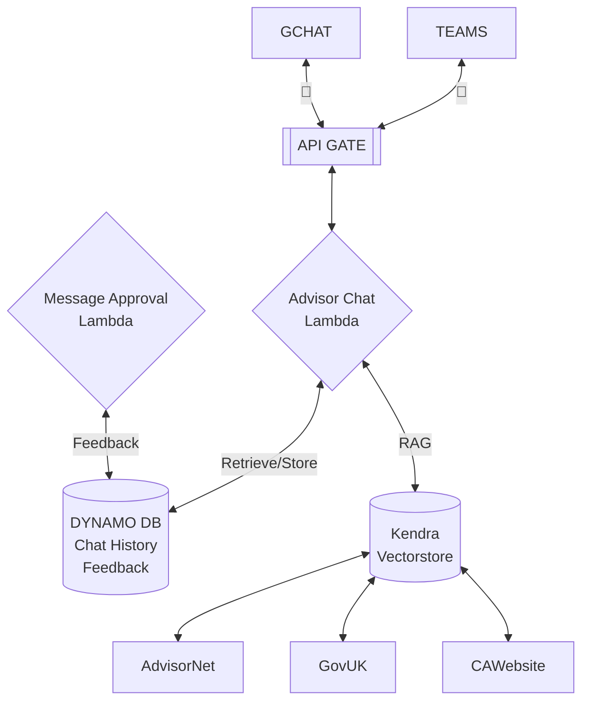

# MVP Architecture

```mermaid
graph TB

  TEAMS[TEAMS] <-->|"🔑"| API_GATE[[API GATE]]
  GCHAT[GCHAT] <-->|"🔑"| API_GATE
  API_GATE <--> ChatLambda{Advisor Chat<br/> Lambda}
  ChatLambda <-->|Retrieve/Store| DYNAMO[(DYNAMO DB<br/>Chat History <br/> Feedback)]
  ChatLambda <--> |RAG| KENDRA[(Kendra<br/>Vectorstore)]
  SupervisionLambda{Message Approval<br/> Lambda} <--> |Feedback| DYNAMO
  KENDRA <--> AdvisorNet
  KENDRA <--> GovUK
  KENDRA <--> CAWebsite


```
